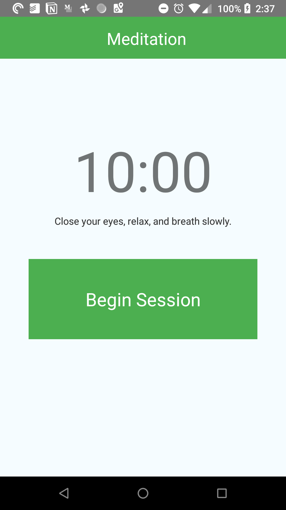
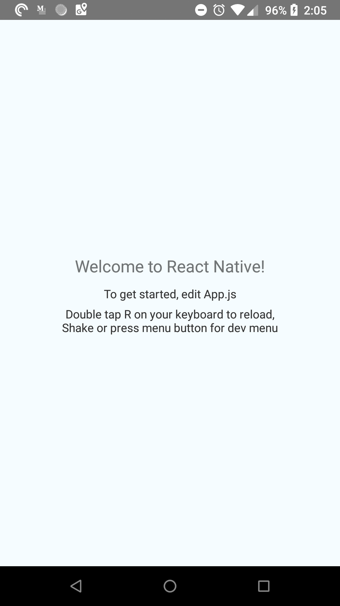
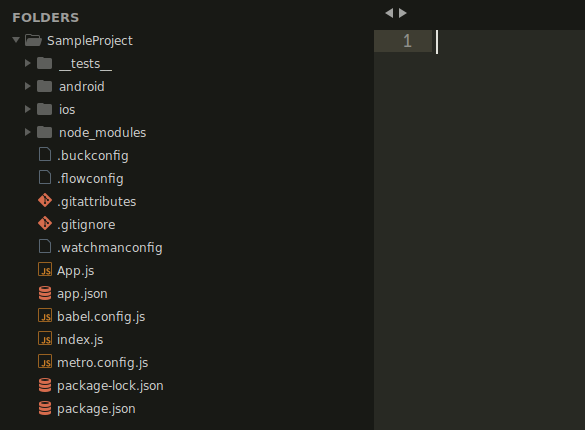

# How to Build a Meditation Timer with React Native

# Let's Build a React Native App Together

## Introduction

In this tutorial I will show you how to create a Meditation Timer with React Native. The difficulty level is medium if have never used React Native before. In this article I provide insights into working React Native along the way with building a real application.

The project we will be building is a simple Meditation Timer. Here is the functionality we will end up will once this tutorial is complete. *Source code: https://github.com/rbk/meditation-timer*

### App Functionality

1. Page loads
2. Header displays text "Meditation Timer"
3. Page shows starting time of 10 minutes
4. Page shows instructions on Meditation
5. Page shows a button with text "Begin Session"
6. User flow →
    1. User presses the button
    2. Button turns red with the text "Stop Session"
    3.  A bell rings signifying the beginning of the meditation
    4. The timer will run for 10 minutes
    5. Once ten minutes has past, the bell rings again.
    6. Button turns green with text "Begin Session"

Here is what it looks like:

## What is React and React Native?

React Native is one of those tools that changes the game forever. Similar to how FrontPage or Dreamweaver changed HTML development, React Native changed how Native mobile applications could be created.

If you do not know what React Native is by now, here is the eagle view: React Native is a framework that can generate native mobile application code (Java for Android, Objective C for iPhone), with javascript using the React javascript framework. Created by Facebook, React has become the defacto framework for creating websites, web apps, and even mobile applications with React Native.

React native depends on React. Facebook completely open sourced React in 2013. React has 1,2494 contributors at the time of this writing.

[https://github.com/facebook/react](https://github.com/facebook/react)

[https://github.com/facebook/react](https://github.com/facebook/react)-native

## Why React Native?

First of all, why is React Native so popular? For one, React Native makes it easy for web developers to create apps with technology they already know. Another great benefit is that it greatly reduces the barrier to develop an app by allowing one to create an app for iOS and Android with practically the same code base.

Here are a few players using React for there product or service:

1. Gatsby - React static site generator
2. Outlook - Browser email application
3. Facebook - Facebook created React

You're in good company.

## Disclaimer: Who is this article for?

If you are brand new to React I would not recommend reading this article. You should have a good understanding of Javascript and React before reading this. Here is the official ReactJS documentation:

[https://reactjs.org/](https://reactjs.org/)

If you do not know Javascript: [https://developer.mozilla.org/en-US/docs/Web/JavaScript](https://developer.mozilla.org/en-US/docs/Web/JavaScript)

Also, knowing basic CSS and especially how Flexbox works is helpful. I recommend A [Complete Guide to Flexbox](https://css-tricks.com/snippets/css/a-guide-to-flexbox/) to learn flexbox.

## Getting Your Workflow Setup

The first thing you need to do before you can developer with React Native is to setup your environment. Follow the official guide for your platform here: [https://facebook.github.io/react-native/](https://facebook.github.io/react-native/). Make sure you use the React Native CLI rather than Expo.

In the beginning the easiest way to start is to use Expo, but we'll use React Native CLI here. Expo includes more default features, but limits advanced usage of React Native. 

You need to have Xcode or an iPhone to develop for iOS and you'll need Android Studio for Windows or Ubuntu. These programs allow you to emulate real devices for testing your application. You can also connect a real device to test with. [https://facebook.github.io/react-native/docs/running-on-device](https://facebook.github.io/react-native/docs/running-on-device)

**What you'll need:**

1. react-native-cli

        npm install -g react-native-cli

2. nodejs - [https://nodejs.org/en/](https://nodejs.org/en/)
3. Java (Android)
4. Android Studio or xCode (device emulation)
5. Device connected to adb server (optional for real device testing)

You can make sure you have a emulator running or a device properly connected by running:

    $ adb devices

The output should be for android:

    List of devices attached
    02564d6445bbc0ad	device

## Ok, Let's Start Building

### Overview

1. Initialize the React Native project with `react-native-cli`
2. Run the development server on an emulator or device
3. Open code in your editor

### Initialize the React Native project

Now that you have your environment setup let's start building. 

First thing is first, open the terminal, initialize your project. Running the follow command from the terminal will install the default React Native code into the specified folder (*SampleProject* is our example folder).

    # In Terminal
    
    # Create project
    react-native init SampleProject
    
    # Go to project
    cd SampleProject

### Run the development server and emulator

At this point you need to get an emulator or device running on your computer if you don't have it already. Run one of the commands below depending on the platform you chose to develop for.

    # Run default application androind
    react-native run-android
    
    # OR
    
    # For iOs
    react-native run-ios

The run command takes awhile the first time you run it. After running the command above you should have the default React Native app running in an emulator or on a device. It looks like this:

*Note: If you haven't gotten this far please read the documentation and look up any errors on [Stackoverflow](https://stackoverflow.com/questions/tagged/react-native) or on github [https://github.com/facebook/react-native](https://github.com/facebook/react-native). It is impossible to catch all the possible errors in one article especially across all platforms.*

### Open your favorite editor

Open the SampleProject the your project folder in your favorite editor. Right away I will tell you that the file we will be working in is App.js. You can actually build your entire application in this file, but I wouldn't recommend it. For our Meditation app, this file will be just fine.

Here is the structure you have from the react-native-cli init script:

## You are now ready to code!

To get started open up App.js and take a look. You'll notice some boilerplate code with some special instructions on setting up the debugger. Lets go ahead enable live reload so that our app will update when we make changes to the source code. This will be specific to your platform:

    {
    ios: 'Press Cmd+R to reload,\n' + 'Cmd+D or shake for dev menu',
    android:
    'Double tap R on your keyboard to reload,\n' +
    'Shake or press menu button for dev menu',
    }

Before we dive in to making the Meditation Timer, let's go over a little more about React, React Native, and styling components.

## The React Way

So a basic idea to work on React apps is to code the markup then go back and work on the functionality. Our app will be super simple so lets mock it up.

First remove everything after `const instructions.`

You should have this after removing all the code after the instructions variable:

    import React, {Component} from 'react';
    import {Platform, StyleSheet, Text, View} from 'react-native';
    
    const instructions = Platform.select({
    ios: 'Press Cmd+R to reload,\n' + 'Cmd+D or shake for dev menu',
    android:
    'Double tap R on your keyboard to reload,\n' +
    'Shake or press menu button for dev menu',
    });

Below the instructions variable create a fresh App class and export it:

    // Always extend React.Component for classes
    export default class App extends React.Component {
    	// Every component must have a minimum of one function called render
    	render() {
    		<View>
    			<Text>Hello World</Text>
    		</View>
    	}
    }

**Two things to note:**

1. Using **View** instead of a div
2. 'Hello World' is wrapped in a **Text** component.

In React Native you have to understand is that it is not HTML at all. You cannot use divs, spans, and other normal HTML elements. We will use **View** instead of a **div** in most cases. 

Text must always be wrapped in a **Text** component.

## Styling React Native Components

Now that we have the basic structure of our app it is time to add styles. **CSS files do not exist in React Native.** Adding styles to elements requires adding a CSS-like objects to components. Here is a nice reference [https://github.com/vhpoet/react-native-styling-cheat-sheet](https://github.com/vhpoet/react-native-styling-cheat-sheet). 

Here are some simple examples of styling a component in React Native:

    // Example 1
    <View style={{paddingTop: 10, backgroundColor: '#ff0000'}}>
    </View>
    
    // Example 2
    const myStyle = {
    	paddingTop: 10,
    	backgroundColor: '#ff0000'
    }
    <View style={myStyle}>
    </View>

As you can see styles in React Native are like CSS but instead of dashes, we use camel case. Font-size would be fontSize in React Native.

A better way to manage your CSS is to use the Stylesheet React object. We can make the code more readable by removing styles from the render function:

    import { StyleSheet } from 'react-native'
    
    const styles = StyleSheet.create({
    	myStyle: {
    		paddingTop: 10,
    		backgroundColor: '#F5FCFF',
    	}
    })

### Use TouchableOpacity to make a Custom Button

React Native comes with default button components that you can use. If you want to make a custom button clickable, you need to wrap whatever it is you want to be clickable in TouchableOpacity. 

    <TouchableOpacity>
    	<Text>Start Session</Text>
    </TouchableOpacity>

## Let's Build the Meditation Timer Now

Now that we have a grip on how coding React Native is different we can start making the app. We will reference the app functionality section from above.

This is what we have so far:

    import React, {Component} from 'react';
    import {Platform, StyleSheet, Text, View} from 'react-native';
    
    const instructions = Platform.select({
    ios: 'Press Cmd+R to reload,\n' + 'Cmd+D or shake for dev menu',
    android:
    'Double tap R on your keyboard to reload,\n' +
    'Shake or press menu button for dev menu',
    });
    // Always extend React.Component for classes
    export default class App extends React.Component {
    	// Every component must have a minimum of one function called render
    	render() {
    		<View>
    			<Text>Hello World</Text>
    		</View>
    	}
    }

## 1. Page loads - Header displays text "Meditation Timer"

First add a stylesheet below our App class. This stylesheet will contain all the styles we need for the app. StyleSheet.create accepts an object as a parameter, in which each key equals a style object.

    const styles = StyleSheet.create({
    	container: {
    		flex: 1,
    		justifyContent: 'center',
    		alignItems: 'center',
    		backgroundColor: '#F5FCFF',
    	}
    })

For the header we add will add two style objects. One top position the header at the top of the screen and one to color the text color of the header.

    // add this to the render function replacing the the line with Hello World
    <View style={styles.header}>
    	<Text style={styles.headerText}>Meditation Timer</Text>
    </View>

    const styles = StyleSheet.create({
    	header: {
    		position: 'absolute',
    		top: 0,
    		height: 60,
    		width: '100%',
    		backgroundColor: '#4CAF50'
    	},
    	headerText: {
    		fontSize: 24,
    		color: '#fff',
    		paddingTop: 15,
    		paddingLeft: 10,
    		textAlign: 'center'
    	}
    })

You should have this as your App component:

    import React, {Component} from 'react';
    import {Platform, StyleSheet, Text, View} from 'react-native';
    
    export default class App extends React.Component {
    	render() {
    		<View>
    			<View style={styles.header}>
    				<Text style={styles.headerText}>Meditation Timer</Text>
    			</View>
    		</View>
    	}
    }

And this for your stylesheet:

    const styles = StyleSheet.create({
    	container: {
    		flex: 1,
    		justifyContent: 'center',
    		alignItems: 'center',
    		backgroundColor: '#F5FCFF',
    	},
    	header: {
    		position: 'absolute',
    		top: 0,
    		height: 60,
    		width: '100%',
    		backgroundColor: '#4CAF50'
    	},
    	headerText: {
    		fontSize: 24,
    		color: '#fff',
    		paddingTop: 15,
    		paddingLeft: 10,
    		textAlign: 'center'
    	},
    });

## Page shows starting time of 10 minutes

Right below that view add the line:

    <Text style={styles.timer}>10:00</Text>

In your stylesheet you'll add this style object with the key of "timer" to make the text big.

    "timer": {
    	fontSize: 80,
    	textAlign: 'center',
    	margin: 10,
    }

## Page shows instructions on Meditation

Below the timer, add the instructions. Remember text is always in a Text component. You could also use text in a prop for custom components.

    <Text>Close your eyes, relax, and breath naturally.</Text>

## Page shows a button with text "Begin Session"

For the button, we'll make one custom to show off how to use TouchableOpacity. TouchableOpacity is required to make something that is not a button have the press capability. Note: Before you can use TouchableOpacity, you need to import it from the React Native package. At the top of your App.js file add **TouchableOpacity**  to the React Native import:

    import {
    	Platform,
    	StyleSheet,
    	Text,
    	View,
    	**TouchableOpacity**,
    } from 'react-native';

Add the following code under the instructions:

    <TouchableOpacity style={styles.beginButton}>
    	<Text style={styles.colorWhite}>Begin Session</Text>
    </TouchableOpacity>

Style the button by adding two more objects to the stylesheet. We'll go ahead and prepare for the stop button as well with the` stopButton` object.

    beginButton: {
    	margin: 40,
    	padding: 40,
    	backgroundColor: '#4CAF50',
    	width: '80%',
    },
    stopButton: {
    	margin: 40,
    	padding: 40,
    	backgroundColor: '#F44336',
    	width: '80%',
    },
    colorWhite: {
    	textAlign: 'center',
    	color: '#fff',
    	fontSize: 26
    },

Putting it all together we should have something like this. If you are having trouble you can always reference the code at https://github.com/rbk/meditation-timer.

    export default class App extends Component {
    	render() {
    		return (
    				<View style={styles.container}>
    					<View style={styles.header}>
    						<Text style={styles.headerText}>Meditation Timer</Text>
    					</View>
    					<Text style={styles.timer}>{this.state.text}</Text>
    					<Text style={styles.instructions}>Close your eyes, relax, and breath naturally.</Text>
    					<TouchableOpacity style={styles.beginButton} onPress={this.beginSession}>
    						<Text style={styles.colorWhite}>Begin Session</Text>
    					</TouchableOpacity>
    				</View>
    			);
    		}
    	}
    }

    const styles = StyleSheet.create({
    	container: {
    		flex: 1,
    		justifyContent: 'center',
    		alignItems: 'center',
    		backgroundColor: '#F5FCFF',
    	},
    	timer: {
    		fontSize: 80,
    		textAlign: 'center',
    		margin: 10,
    	},
    	instructions: {
    		textAlign: 'center',
    		color: '#333333',
    		marginBottom: 5,
    	},
    	beginButton: {
    		margin: 40,
    		padding: 40,
    		backgroundColor: '#4CAF50',
    		width: '80%',
    	},
    	stopButton: {
    		margin: 40,
    		padding: 40,
    		backgroundColor: '#F44336',
    		width: '80%',
    	},
    	colorWhite: {
    		textAlign: 'center',
    		color: '#fff',
    		fontSize: 26
    	},
    	header: {
    		position: 'absolute',
    		top: 0,
    		height: 60,
    		width: '100%',
    		backgroundColor: '#4CAF50'
    	},
    	headerText: {
    		fontSize: 24,
    		color: '#fff',
    		paddingTop: 15,
    		paddingLeft: 10,
    		textAlign: 'center'
    	},
    });

## Install Third-party Dependencies

Before we get into the user flow I need to mention that this project requires two external libraries that need to be imported.

1. React Native Sound - To play sounds in React code.
2. React Native Background Timer - This allows our timer to continue even when the screen is locked.

**Install -** Run these commands from your project root in the terminal

    npm -i --save react-native-sound
    npm -i --save react-native-background-timer

**Import -** Add to top of App.js

    import BackgroundTimer from 'react-native-background-timer';
    import Sound from 'react-native-sound';

## User flow

Now that we have everything styled and our dependencies met, lets make it work. We will need to fill in all of these functions for our App class. Starting with the constructor, we will set the initial state. For the state we just need to set the initial timer text and whether or not the timer is in progress.

    constructor(props) {
    	super(props)
    	this.state = {
    		text: '10:00',
    		sessionInProgress: false
    	}
    }
    playTone () {}
    resetTimer () {}
    startTimer () {}
    beginSession = () => {}
    stopSession = () => {}

### User presses the button

Next add a function to handle the click of the begin button. Don't worry about the function calls, we'll build them later.

    constructor(props) {
    	super(props)
    	this.state = {
    		text: '10:00',
    		sessionInProgress: false
    	}
    }
    playTone () {}
    resetTimer () {}
    startTimer () {}
    beginSession = () => {
    	this.playTone()
    	this.startTimer()
    	this.setState({
    		sessionInProgress: true
    	})
    }
    stopSession = () => {}

When a user presses the Begin button we want the timer to start. Add an onPress prop to the TouchableOpacity component that calls "this.beginSession".

    <TouchableOpacity style={styles.beginButton} onPress={this.beginSession}>
    	<Text style={styles.colorWhite}>Begin Session</Text>
    </TouchableOpacity>

### Button turns red with the text "Stop Session"

When the users pressed the button we set the state variable **sessionInProgress** to true. We can now use this variable to show the stop button with a little JSX magic. Update the App component to  show one button or the other depending on the state.

    { !this.state.sessionInProgress &&
    	<TouchableOpacity style={styles.beginButton} onPress={this.beginSession}>
    		<Text style={styles.colorWhite}>Begin Session</Text>
    	</TouchableOpacity>
    }
    { this.state.sessionInProgress &&
    	<TouchableOpacity style={styles.stopButton} onPress={this.stopSession}>
    		<Text style={styles.colorWhite}>Stop Session</Text>
    	</TouchableOpacity>
    }

### A bell rings signifying the beginning of the meditation

This is where we need our Sound library. Before we can play a sound we need to download one. Find a bell sound online that you like. Once you have the mp3 or wav file, you need to add it to the the Android "res" folder. In your project you need to add a folder called "raw" here:

    SampleProjectRoot/android/app/src/main/res/

Then add your audio file to the raw directory like this:

    SampleProjectRoot/android/app/src/main/res/raw/audio_file.mp3

Now that you have the audio create the playSound function in our class called playTone:

    constructor(props) {
    	super(props)
    	this.state = {
    		text: '10:00',
    		sessionInProgress: false
    	}
    }
    playTone() {
    	const sound = new Sound('start_tone.mp3', null, (error) => {
    		if (error) {
    			alert(JSON.stringify(error))
    		}
    		sound.play();
    	});
    }
    resetTimer () {}
    startTimer () {}
    beginSession = () => {
    	this.playTone()
    	this.startTimer()
    	this.setState({
    		sessionInProgress: true
    	})
    }
    stopSession = () => {}

playTone will be called every time the user presses the begin button!

### The timer will run for 10 minutes

In addition to playing the sound, the timer needs to start. For this timer we use the react-native-background-timer package so that our timer runs even when the phone is locked. Here we fill in the startTimer function. The start timer function updates the state.timer property. 

    constructor(props) {
    	super(props)
    	this.state = {
    		text: '10:00',
    		sessionInProgress: false
    	}
    }
    playTone() {
    	const sound = new Sound('start_tone.mp3', null, (error) => {
    		if (error) {
    			alert(JSON.stringify(error))
    		}
    		sound.play();
    	});
    }
    resetTimer () {}
    startTimer () {
    	let seconds = 60*10
    	let seconds = 60*10
    	// [https://github.com/ocetnik/react-native-background-timer](https://github.com/ocetnik/react-native-background-timer)
    	BackgroundTimer.runBackgroundTimer(() => {
    		let secondHand = currSeconds % 60
    		secondHand = (secondHand === 0) ? '00' : secondHand
    		secondHand = (secondHand !== '00' && secondHand < 10) ? `0${secondHand}` : secondHand
    		let displayTimer = `${Math.floor(currSeconds/60)}:${secondHand}`
    		this.setState({
    			text: displayTimer
    		})
    		if (currSeconds === 0) {
    			this.stopSession()
    			this.playTone()
    		}
    		currSeconds--
    	}, 1000)
    }
    beginSession = () => {
    	this.playTone()
    	this.startTimer()
    	this.setState({
    		sessionInProgress: true
    	})
    }
    stopSession = () => {}

For the visual update to appear we need to modify our component to use the state.text field.

    //Change
    <Text style={styles.timer}>10:00</Text>
    
    // To
    <Text style={styles.timer}>{this.state.text}</Text>

### Once ten minutes has past, the bell rings again.

The startTimer uses an interval to count down the seconds so we know when to stop the timer and sound the bell. All we need to do now is add the stopSession and resetTimer functions to our App component:

    constructor(props) {
    	super(props)
    	this.state = {
    		text: '10:00',
    		sessionInProgress: false
    	}
    }
    playTone() {
    	const sound = new Sound('start_tone.mp3', null, (error) => {
    		if (error) {
    			alert(JSON.stringify(error))
    		}
    		sound.play();
    	});
    }
    resetTimer () {
    	this.setState({
    		text: '10:00',
    		sessionInProgress: false
    	})
    	BackgroundTimer.stopBackgroundTimer();
    }
    startTimer () {
    	let seconds = 60*10
    	let seconds = 60*10
    	// [https://github.com/ocetnik/react-native-background-timer](https://github.com/ocetnik/react-native-background-timer)
    	BackgroundTimer.runBackgroundTimer(() => {
    		let secondHand = currSeconds % 60
    		secondHand = (secondHand === 0) ? '00' : secondHand
    		secondHand = (secondHand !== '00' && secondHand < 10) ? `0${secondHand}` : secondHand
    		let displayTimer = `${Math.floor(currSeconds/60)}:${secondHand}`
    		this.setState({
    			text: displayTimer
    		})
    		if (currSeconds === 0) {
    			this.stopSession()
    			this.playTone()
    		}
    		currSeconds--
    	}, 1000)
    }
    beginSession = () => {
    	this.playTone()
    	this.startTimer()
    	this.setState({
    		sessionInProgress: true
    	})
    }
    stopSession = () => {
    	this.resetTimer()
    	this.setState({
    		sessionInProgress: false
    	})
    }

### Button turns green with text "Begin Session"

This will happen because we set the state back to its initial state once the timer ends. The button will "React" to the state automatically.

## Conclusion

And there we have it! A simple Meditation timer app built with React Native.  In this tutorial I covered the very basics of working with React Native including how to use React Native's markup, styles, and TouchableOpcity. There are many more advanced topics dealing with React Native such as navigation, network requests, and cross platform differences that need to be learned in order to make a React Native app production ready.  I hope this helps you get started with React Native. Good Luck.Thanks for reading!

*Source code: [https://github.com/rbk/meditation-timer](https://github.com/rbk/meditation-timer)* 

## Bonus: Gotchas & Quick Tips

### Gotchas

- Don't change the app name in app.json (the project won't build unless you change it everywhere)
- Get used to re-building after crashes - You'll find that syntax mistakes can cause the app to crash easily.
- Be wary of unsupported packages
    - React Native is still pretty new

### Quick Tips

- Have a good understanding of flexbox
- Have a good understanding of javascript `export`
- Be comfortable with React in the browser
- Start with a simple prototype to understand the work flow
- Get a phone stand if you are using a real device to develop with
- Save often to test your changes
- Shake your phone for debugging menu

## Open Source Resources to Help you on your Journey

- List of awesome resources - [https://github.com/jondot/awesome-react-native](https://github.com/jondot/awesome-react-native)
- UI kit - [https://github.com/react-native-training/react-native-elements](https://github.com/react-native-training/react-native-elements)
- Better way to style components - [https://www.styled-components.com/](https://www.styled-components.com/)
- Animations - [https://github.com/react-spring/react-spring](https://github.com/react-spring/react-spring)
- React Native Style Reference - [https://github.com/vhpoet/react-native-styling-cheat-sheet](https://github.com/vhpoet/react-native-styling-cheat-sheet)